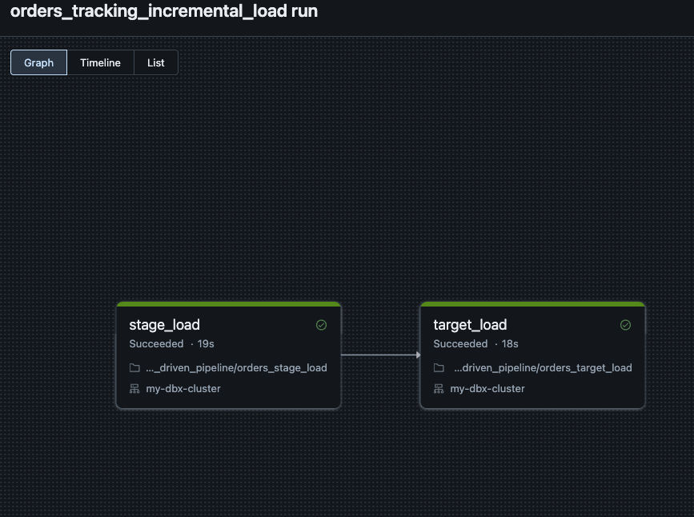
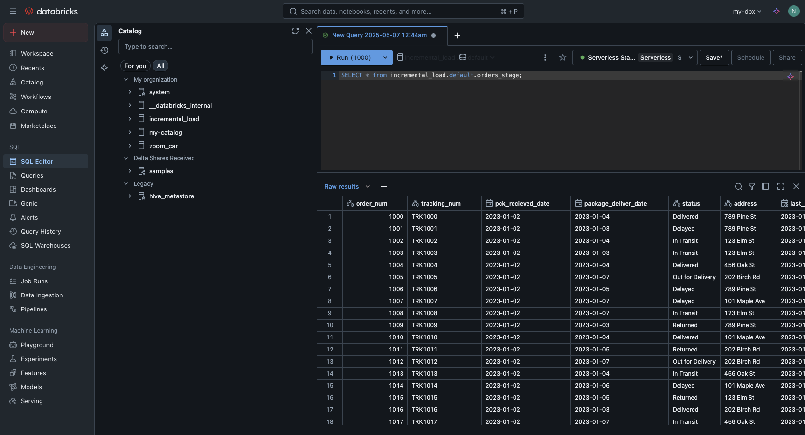
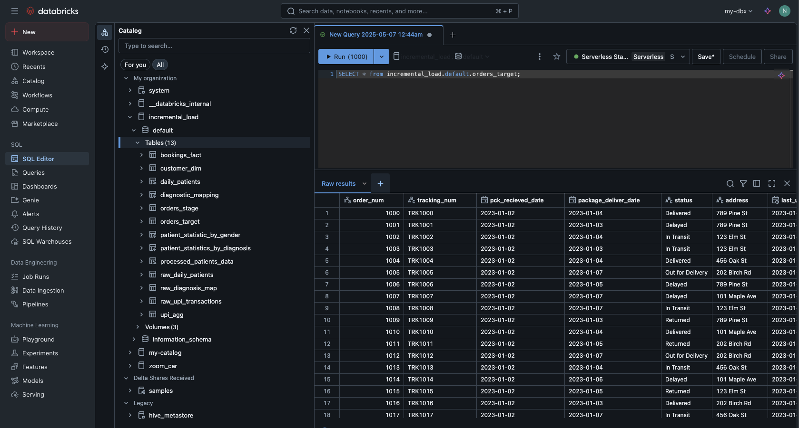

# 🧪 Databricks Event-Driven Pipeline

This project demonstrates a basic **event-driven data pipeline** using **Databricks** with Delta Lake integration.

---

## 📂 Project Structure

```
databricks_event_driven_pipeline/
├── orders_stage_load.ipynb         # Loads order data from source and stages into a Delta table
├── orders_target_load.ipynb        # Merges the staged data into the target Delta table with logic
├── screenshots/
│   ├── job_run.png                 # Screenshot showing successful job execution
│   ├── orders_stage.png           # Snapshot of staged data
│   └── orders_target.png          # Snapshot of merged target data
```

---

## 🚀 Pipeline Overview

### 1. **orders_stage_load.ipynb**
- Reads incoming CSV files from a mounted volume (e.g., `/Volumes/.../source/`).
- Writes the cleaned data to a **Delta table** named `orders_stage`.

### 2. **orders_target_load.ipynb**
- Reads data from the `orders_stage` table.
- Checks if the `orders_target` table exists:
  - If not, creates and loads it from stage.
  - If yes, performs a **merge operation**:
    - Updates matching records.
    - Inserts new records.
    - Deletes records marked as cancelled (using `whenMatchedDelete`).

---

## 🖼️ Visuals

### ✅ Job Execution Screenshot


### 📊 Staging Table Preview


### 🧾 Target Table Preview


---

## 🧰 Tech Stack

- **Apache Spark** (PySpark)
- **Delta Lake**
- **Databricks Notebooks**
- **Python**
- **GCP / DBFS / External Volumes**

---

## 📌 Usage

1. Place incoming CSV data into your source volume folder.
2. Run the `orders_stage_load.ipynb` notebook to ingest and stage data.
3. Run the `orders_target_load.ipynb` to merge staged data into your target Delta table.
4. Monitor the pipeline execution via job runs and data validation screenshots.

---

## 📝 Note

Ensure you configure the Spark session and Delta table paths correctly for your Databricks environment.
